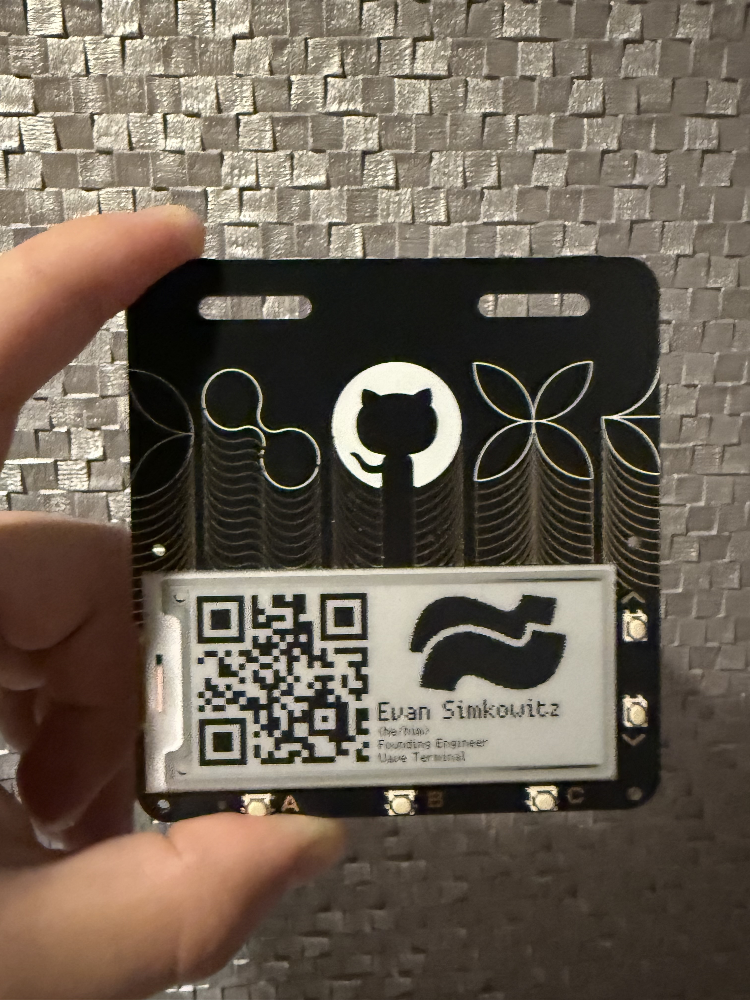

# badger
My GitHub Universe Badge

At GitHub Universe 2024, attendees are given [hackable badges](https://gh.io/badger). This is my custom badge, featuring a QR code to [Wave Terminal](https://waveterm.dev), our logo, and some info about me.

## Setup

Setting this up was a real pain, involving bricking two separate badges. If you have the GitHub Universe RP2350 badge, DO NOT flash the firmware from the release page for repo I am about to link.

I followed [this tutorial](https://github.com/badger/home/blob/main/tutorial.md) to connect to the badge and upload my app.

Using the method described in the tutorial, copy the `evan` directory to the `/` root directory on the badge and copy `evan.py` and `icon-evan.py` to the `/examples` directory on the badge.